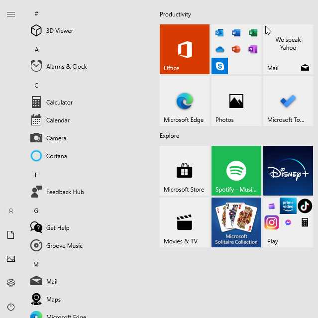

# windows-bloatware-manager

### This is a PowerShell script allowing the user to uninstall or reinstall most bloatware on Windows 10 22H2.

---
### Introduction

As newer versions of Windows release, we have been seeing more and more bloatware come pre-installed on fresh Windows images.
Not only this, but there are now shortcuts pre-built on the Windows start menu encouraging the user to install apps such as TikTok and FaceBook Messenger.

Below is a screenshot of the default view of the Windows start menu on a fresh install of Windows 10 22H2.

---
### Caution

PowerShell is a powerfull Windows scripting language that could enable a user to unkowningly cause irreversible damage to their system.
I encourage anyone who utilizes this script to verify they understand the code being executed.
As this script is set up, the apps affected by the choices the user makes will carry over all users of the host machine.

---

### How-To

1. First you will want to want to run PowerShell as Administrator
2. Allow script execution\
`Set-ExecutionPolicy Unrestricted`
3. Download the PowerShell script from this repo\
`cd ~\Downloads`\
`Invoke-WebRequest https://github.com/nicolasawelsh/windows-bloatware-manager/blob/main/app_manager.ps1 -OutFile app_manager.ps1`
4. Execute the script\
`.\app_manager.ps1`
5. Disallow script execution\
`Set-ExecutionPolicy Restricted`

If you at any point wish to reinstall all default Windows apps, execute the following line in PowerShell:\
`Get-AppxPackage -AllUsers| Foreach {Add-AppxPackage -DisableDevelopmentMode -Register "$($_.InstallLocation)\AppXManifest.xml"}`
